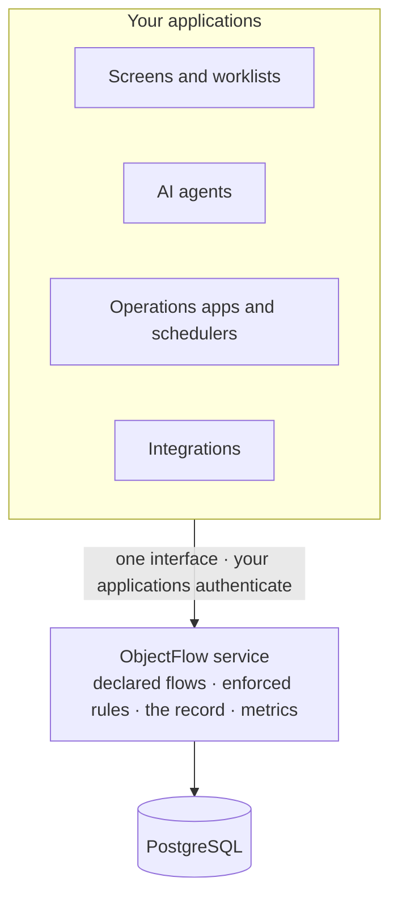

# ObjectFlow

**An agent-safe system of record for business workflows.**

Governed flows for business objects. People and agents move objects only along declared transitions; every change is checked, recorded and measured.

> **Status: in design.** There is no runnable code yet. This repository holds the complete design: the requirements, the model, the language flows are declared in, every decision with the alternatives it rejected, and the checkers that hold it together. See [where it stands](#where-it-stands).

## The problem

**Business rules end up everywhere.** In the first consumer, the system being rebuilt on ObjectFlow, 454 sites refuse an operation. **176 of them are redundant**, the same rule expressed again somewhere else, and 51 distinct rules appear at more than one site, across route checks, service methods, model hooks and database constraints. One rule, "a delivery must be in preparation", is written five times in four files. Nobody can print what the system allows, review it, or hand it to an agent.

**Flows are defined once and never measured.** A system of record keeps the result of each step and nothing about the flow: where work waits, which rule is in the way, whether a change to the process helped.

**AI agents now act on business systems.** They need rules they cannot bypass, answers they can act on when they are refused, and the same data a person sees.

## What it does

- **Declare.** Object types, their states, the transitions between them and the rules on each are written once, in a small language. A declaration is checked when it is published, can be printed for review, and is the only authority on what may change.
- **Enforce.** Every request, from a person, a service or an agent, is checked against the declared rules. A refusal names the rule that refused and what to do next: supply something, ask someone, wait, or work on another object first. Nothing is ever half-applied.
- **Record.** Every transition, refusal, override and change of hands is kept, with who did it, what kind of actor they were, and when it happened as well as when it was recorded. People add their own datapoints, such as an inspection result, and nothing is edited, only corrected.
- **Measure.** Time in each state, throughput, where work waits, which rules refuse most and who holds what exist from the first request, with nothing to instrument. Formulas and metrics are declared once and read the same way by every screen, report and agent.
- **Improve.** A flow can start with no rules at all. The record shows where the flow and reality disagree, a new rule can run on trial before it is enforced, and a change is a reviewed publish that keeps history intact.

## Built for AI agents

Agents are governed exactly as people are, which is what makes handing them work safe.

- **One interface, one set of rules.** An agent acts through the same requests as a person and is refused by the same rules. There is no side door.
- **It can ask what it may do.** `availability` evaluates the real rules against the real data and says, for each transition, whether it is available, needs input, or is blocked and why.
- **A refusal is an instruction.** Every refusal carries a remedy, so an agent knows whether to fix its request, ask a person, wait, or work on something else first.
- **Its tools come from the rules.** Agent tool definitions are generated from the declaration, so they cannot drift from what is enforced.
- **What an agent is, is declared.** Whether an actor is a person, an agent or a service is declared with its type, so a rule such as "an agent may prepare a financial write but never commit one" cannot be dodged by a request.
- **Agents propose, people approve.** An agent without the authority can file a proposal, and an agent can draft a change to a flow that only a person may approve.
- **Agents are measured beside people.** Every metric splits by kind of actor, so you can see where agents stall and people do not.

## What it looks like

A returns flow, published with no rules at all and measured from its first request:

```text
type Return version 1 {
  tracking record
  states   RECEIVED category inbound, INSPECTING category live,
           RESOLVED category closed, CLOSED category closed terminal
  summary  unit, customer, state

  ref      unit     : Robot
  ref      customer : Customer

  create receive -> RECEIVED accepts unit, customer { }
  do inspect RECEIVED   -> INSPECTING { }
  do resolve INSPECTING -> RESOLVED   { }
  do close   RESOLVED   -> CLOSED     { }
}
```

A month later its own data shows where it waits, and the next version adds rules only where they are needed. A replacement now needs a lead once the robot's model keeps coming back:

```text
  do resolve INSPECTING -> RESOLVED {
    input outcome : ReturnOutcome
    require may:        actor.has(RETURNS_EDIT) because delegable
    require second_eye: inputs.outcome != ReturnOutcome.REPLACED
                        or actor.has(RETURNS_LEAD)
                        or metric(returns_by_model, model := unit.model, over last 30 days) < 5
                                                                             because delegable
    set outcome := inputs.outcome
  }
```

An engineer, or an agent, who asks for a replacement without that authority gets an answer it can act on rather than an error:

```python
Unsatisfied(clause="second_eye", remedy=Remedy.DELEGABLE, unknown=False,
            capability="RETURNS_LEAD", proposable=False)
```

Both versions are checked modules in [`docs/design/returns-module.md`](docs/design/returns-module.md).

## Where it sits



ObjectFlow runs as an internal service beside your applications, one per store, and it is the only thing that writes the store. Your applications authenticate their users and map their roles to capabilities; ObjectFlow enforces what each capability permits ([ADR-0110](docs/adr/0110-an-internal-service-with-authentication-upstream-and-declared-actor-kinds.md)).

What it is not:
- **Not a workflow orchestrator.** It never starts a transition. Schedules, timers, chasing and notifications live in the applications above it, which act through the same interface as anyone else.
- **Not a UI or low-code platform.** It has no screens, though it answers by query every question a worklist needs.
- **Not an identity system.** Who a caller is, and which roles they hold, stay with your applications.
- **Not an analytics warehouse.** It computes its declared metrics, and exports its data for exploration elsewhere.

## Why not just use…

- **An ORM?** An ORM abstracts mechanism: it hides SQL and faithfully executes whatever the caller asks. ObjectFlow abstracts authority: what may change, when, and by whom.
- **A state-machine library?** It checks transitions inside one application. Any other code path can still write the table, and nothing is recorded or measured.
- **A workflow engine?** It drives processes forward. ObjectFlow governs the data those processes touch, and leaves the driving to them.

## Designed against a real system

ObjectFlow's first consumer is the author's robotics operations platform: inventory, deliveries and service in production today, with loans and leasing designed, and every row of its data to be ported. The design has been checked rule by rule against that system's production code ([`first-consumer-audit.md`](docs/design/first-consumer-audit.md)) and against its own product requirements ([`first-consumer-prd-check.md`](docs/design/first-consumer-prd-check.md)). Its worked examples are written as checked modules: a unit's whole journey from purchase request to lease-to-own, and a returns flow tightened from its own data.

## Where it stands

In design, under review by its author. What exists:

- [**Requirements**](docs/PRD.md): what the product must do, and the use cases every design choice is tested against.
- [**Design**](docs/DESIGN.md): the model, how a request executes, history, the read surface, and the known limits.
- [**Declaration language**](docs/design/declaration-syntax.md): the language flows are written in, and the checks publishing runs over it, enforced by a checker against every example in the record.
- [**Decisions**](docs/adr/): each one with the alternatives it rejected and why.
- [**Traceability**](docs/design/traceability.md): every requirement mapped to what meets it; a checker fails while any is not covered.
- **Worked examples**: [a unit's journey](docs/design/unit-journey.md), [a returns flow](docs/design/returns-module.md), and [an operations review](docs/design/flow-review.md) of the journey.

Next come the author's review of the open decisions, then the first implementation; its language and the service's transport are still open. [`TODO.md`](TODO.md) says exactly where things stand.

To check the record, run `python3 scripts/check-corpus.py`. It runs every checker: the declaration language's rules over every example, the storage schema's SQL, the library API, the agent tool schemas, and the traceability map.

## License

[Apache License 2.0](LICENSE).
