# Jira's typical flows, in the flow description format

Status: **catalogue**, 2026-09-27. Beside the robot inventory example, the typical flows Jira's templates ship, each written as a module in the flow description format ([`flow-format.md`](flow-format.md)), with the state diagram drawn from it. Every module passes all four steps of the flow checker, and every diagram is the one `scripts/flow-diagram.py` draws from its module: `scripts/check-flow-docs.py` checks both on every corpus run (ADR-0121). The Jira coverage studies ([`case-study-tickets.md`](case-study-tickets.md) §6 and §7) map each workflow feature Jira documents to the format; this catalogue writes the flows themselves.

**What Atlassian states, and what the catalogue chooses.** Atlassian's documentation says what each template is for, and for most templates shows the workflow only in the product: "Select a template to view more information, including the template’s default work types and workflow." ([Create a business space](https://support.atlassian.com/jira-software-cloud/docs/create-a-business-project/)) Of the 61 templates its documentation named on 2026-09-27, 11 have their statuses stated in text and 4 their transitions. So each flow says, under **Source**, which of its statuses, transitions and rules Atlassian states, quoted from the page's raw text and checked against it by script, and which the catalogue chose to complete the flow; nothing chosen is presented as Jira's. A template whose workflow the text does not state at all is listed in §5, not drawn.

**Reading a flow.**
- A status's category is one of Jira's three, "Each status falls into one of three categories: ‘To do', ‘In progress’, and ‘Done’." ([Set up a workflow](https://support.atlassian.com/jira-software-cloud/docs/set-up-a-workflow-in-a-team-managed-software-project/)), written as the categories `todo`, `in_progress` and the built-in `closed` (`case-study-tickets.md` §6.1).
- Every lifecycle in the model ends in a final state (the model's check 15), and a Jira workflow need not, since Done may be left again. Each work item's flow therefore ends in `ARCHIVED`, reached from any status, which is Jira's archiving: "If you archive a work item, it will only appear in Archived work items and can no longer be edited." ([Archive a work item](https://support.atlassian.com/jira-software-cloud/docs/archive-an-issue/)) The service flows end in the closed statuses Atlassian names.
- The diagrams are UML state machines: `[*]` is where an object starts and ends, an edge is labelled with its transition and, in brackets, the guards it declares, and a status's colour is its category. A transition from any status starts at the dashed `any status`, as Jira's workflow editor draws a global transition, and stands for an edge from every other status that is not final: no transition leaves a status for itself (ADR-0122). A status lists the internal transitions it may take, which change no status, under its name as `↻`. Not drawn: the guard the format generates for a required input of an optional attribute (`flow-format.md` §6), an erasure, which changes no status, and a type that only supports a flow's main one, which its module declares.
- Who may take a transition, Jira's conditions on roles and permissions, and screens, boards and notifications are the upper layer's (ADR-0114, PRD N6). A transition Jira takes by itself, by automation, is requested by an application; where the automation waits for a condition, such as three days after a resolution, the flow declares the guard that holds it, and where it waits for nothing the flow can read, such as a standard change's approval or a deployment's result, the transition is unguarded and the application decides when to request it (`case-study-tickets.md` §7.2).

**The people.** The flows that name a person import them from one module:

```yaml
module: jira_people
categories: [live, closed]

types:
  User:
    description: A person who works in Jira, who may be assigned work, report it or approve it.
    tracking: record

    attributes:
      account_id: { type: identity, actor_kind: human, unique: true }
      name:       { type: string, optional: true, personal: true }

    states:
      ACTIVE:      { category: live }
      DEACTIVATED: { category: closed, final: true }

    transitions:
      add:
        kind: initial
        to: ACTIVE
        required_inputs: [account_id]
        optional_inputs: [name]
      deactivate:
        kind: external
        from: ACTIVE
        to: DEACTIVATED
      forget:
        kind: erasure
        inputs:
          reason: { type: string }
```

## 1. Jira

The software templates' workflows, the default Jira workflow of a company-managed space, a workflow Atlassian builds as a worked example, and the two object lifecycles a Scrum board relies on, sprints and versions.

### 1.1 A team-managed space's workflow

A team-managed software space from the Scrum or Kanban template starts with three statuses, and a work item moves between them freely.

**Source.**
- Statuses, stated: "The default columns and statuses are To do, In progress, and Done." ([Configure columns and statuses](https://support.atlassian.com/jira-software-cloud/docs/configure-columns-and-statuses-in-your-team-managed-project/))
- Transitions, chosen here: every status from every other. Atlassian shows the default transitions only in the workflow editor; the rule it states for a new status is the one used, "By default, new statuses allow work items in any other status to move into them." ([Create, edit and delete statuses](https://support.atlassian.com/jira-software-cloud/docs/create-edit-and-delete-statuses-in-team-managed-projects/)), and it cautions against the other kind: "Take care when creating transitions that don’t start from Any status." ([Create, edit and delete transitions](https://support.atlassian.com/jira-software-cloud/docs/create-edit-and-delete-transitions-in-team-managed-projects/))

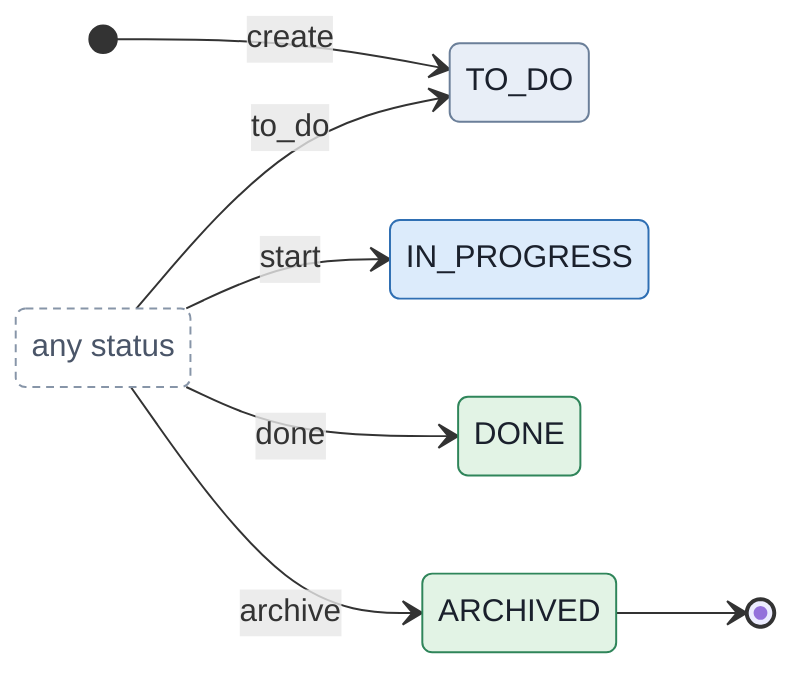

```yaml
module: jira_team_managed
categories: [todo, in_progress, closed]

types:
  WorkItem:
    description: A work item of a team-managed software space, on the workflow the space starts with.
    tracking: record

    attributes:
      summary: { type: string }

    states:
      TO_DO:       { category: todo }
      IN_PROGRESS: { category: in_progress }
      DONE:        { category: closed }
      ARCHIVED:    { category: closed, final: true }

    transitions:
      create:
        kind: initial
        to: TO_DO
        required_inputs: [summary]
      to_do:
        kind: external
        from: any
        to: TO_DO
        description: Moves the work item back to To do, from any status.
      start:
        kind: external
        from: any
        to: IN_PROGRESS
        description: Moves the work item to In progress, from any status.
      done:
        kind: external
        from: any
        to: DONE
        description: Moves the work item to Done, from any status.
      archive:
        kind: external
        from: any
        to: ARCHIVED
        description: Archives the work item, which can then no longer be edited.
```

Jira's *Any status* is `from: any` (`flow-format.md` §4.8), every status that is not final.

### 1.2 A company-managed Scrum board's simplified workflow

A company-managed Scrum space's board uses the simplified workflow: three statuses, free movement, and a resolution set when a work item reaches the last column.

**Source.**
- Statuses, stated: "Has three default statuses for Scrum boards: To do, In progress, Done" ([What is a simplified Jira workflow?](https://support.atlassian.com/jira-software-cloud/docs/what-is-a-simplified-jira-workflow/))
- Transitions, stated as a rule: "Allows work items to be dragged freely between columns" ([What is a simplified Jira workflow?](https://support.atlassian.com/jira-software-cloud/docs/what-is-a-simplified-jira-workflow/))
- Rules, stated: "Automatically sets a resolution of 'Done' when work items are transitioned to the 'successful' column" ([What is a simplified Jira workflow?](https://support.atlassian.com/jira-software-cloud/docs/what-is-a-simplified-jira-workflow/)), and "Displays no screens on any transitions, all transitions will happen instantly." ([What is a simplified Jira workflow?](https://support.atlassian.com/jira-software-cloud/docs/what-is-a-simplified-jira-workflow/))
- Chosen here: a work item dragged out of Done loses its resolution, which is what the model's `clear` exists for (`declaration-syntax.md` §5.2); Atlassian does not state what Jira does.


```yaml
module: jira_scrum
categories: [todo, in_progress, closed]

enumerations:
  Resolution: [DONE, WONT_DO, DUPLICATE, CANNOT_REPRODUCE]

types:
  WorkItem:
    description: A work item of a company-managed Scrum space, on the simplified workflow its board starts with.
    tracking: record

    attributes:
      summary:    { type: string }
      resolution: { type: Resolution, optional: true }

    states:
      TO_DO:       { category: todo }
      IN_PROGRESS: { category: in_progress }
      DONE:        { category: closed }
      ARCHIVED:    { category: closed, final: true }

    transitions:
      create:
        kind: initial
        to: TO_DO
        required_inputs: [summary]
      to_do:
        kind: external
        from: any
        to: TO_DO
        description: Drags the work item to To do, from any column, clearing the resolution it may have had in Done.
        effect:
          - clear: [resolution]
      start:
        kind: external
        from: any
        to: IN_PROGRESS
        description: Drags the work item to In progress, from any column, clearing the resolution it may have had in Done.
        effect:
          - clear: [resolution]
      done:
        kind: external
        from: any
        to: DONE
        description: Drags the work item to Done, the successful column, which sets its resolution to Done.
        effect:
          - assign: { location: resolution, expr: Resolution.DONE }
      archive:
        kind: external
        from: any
        to: ARCHIVED
        description: Archives the work item, which can then no longer be edited.
```

No transition takes an input, as no screen asks for one; `done` writes the resolution itself.

### 1.3 A company-managed Kanban board's simplified workflow

The Kanban board's simplified workflow adds a backlog and a column of work selected for development.

**Source.**
- Statuses, stated: "Has four default statuses for Kanban boards: Backlog, Selected for development, In progress, Done" ([What is a simplified Jira workflow?](https://support.atlassian.com/jira-software-cloud/docs/what-is-a-simplified-jira-workflow/))
- Transitions and rules, stated: as for the Scrum board (§1.2), on the same page.
- Categories, chosen here: Backlog and Selected for development are to do. Atlassian describes the backlog as "The work item is waiting to be picked up in a future sprint." ([Statuses, priorities and resolutions](https://support.atlassian.com/jira-cloud-administration/docs/what-are-issue-statuses-priorities-and-resolutions/))

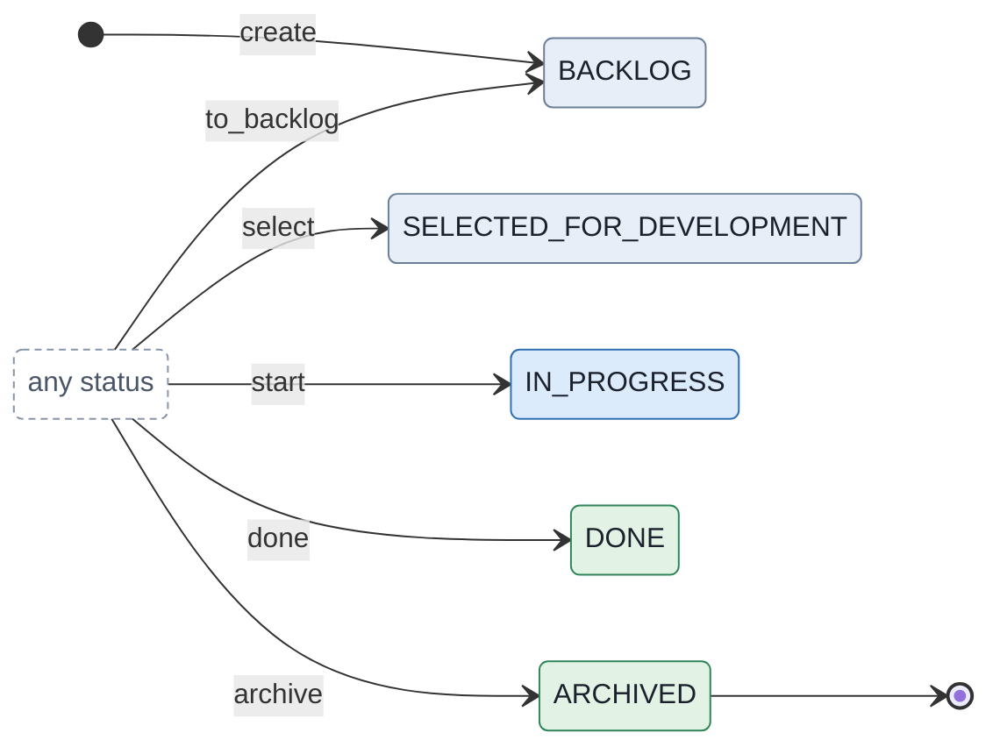

```yaml
module: jira_kanban
categories: [todo, in_progress, closed]

enumerations:
  Resolution: [DONE, WONT_DO, DUPLICATE, CANNOT_REPRODUCE]

types:
  WorkItem:
    description: A work item of a company-managed Kanban space, on the simplified workflow its board starts with.
    tracking: record

    attributes:
      summary:    { type: string }
      resolution: { type: Resolution, optional: true }

    states:
      BACKLOG:                  { category: todo }
      SELECTED_FOR_DEVELOPMENT: { category: todo }
      IN_PROGRESS:              { category: in_progress }
      DONE:                     { category: closed }
      ARCHIVED:                 { category: closed, final: true }

    transitions:
      create:
        kind: initial
        to: BACKLOG
        required_inputs: [summary]
      to_backlog:
        kind: external
        from: any
        to: BACKLOG
        description: Drags the work item to Backlog, from any column, clearing the resolution it may have had in Done.
        effect:
          - clear: [resolution]
      select:
        kind: external
        from: any
        to: SELECTED_FOR_DEVELOPMENT
        description: Drags the work item to Selected for development, from any column, clearing the resolution it may have had in Done.
        effect:
          - clear: [resolution]
      start:
        kind: external
        from: any
        to: IN_PROGRESS
        description: Drags the work item to In progress, from any column, clearing the resolution it may have had in Done.
        effect:
          - clear: [resolution]
      done:
        kind: external
        from: any
        to: DONE
        description: Drags the work item to Done, the successful column, which sets its resolution to Done.
        effect:
          - assign: { location: resolution, expr: Resolution.DONE }
      archive:
        kind: external
        from: any
        to: ARCHIVED
        description: Archives the work item, which can then no longer be edited.
```

### 1.4 The default Jira workflow

A company-managed space not on the simplified workflow uses the default Jira workflow, with a resolution chosen on a screen and statuses that record whether it was verified.

**Source.**
- Statuses and their board columns, stated: "If your board's space is using the default Jira workflow:" ([Configure columns](https://support.atlassian.com/jira-software-cloud/docs/configure-columns/)) To Do holds Open and Reopened, In Progress holds In Progress, and Done holds Resolved and Closed, which the categories follow.
- Transitions, stated in part by the statuses' descriptions: Resolved "From here, work items are either reopened, or are closed." ([Statuses, priorities and resolutions](https://support.atlassian.com/jira-cloud-administration/docs/what-are-issue-statuses-priorities-and-resolutions/)), Closed "Work items which are closed can be reopened." ([Statuses, priorities and resolutions](https://support.atlassian.com/jira-cloud-administration/docs/what-are-issue-statuses-priorities-and-resolutions/)), and Reopened "From here, work items are either marked assigned or resolved." ([Statuses, priorities and resolutions](https://support.atlassian.com/jira-cloud-administration/docs/what-are-issue-statuses-priorities-and-resolutions/)), read as Reopened to Resolved, and to In Progress for "assigned", since no status is named that.
- Transitions, chosen here: Open to In Progress and back, and resolving from Open and In Progress. The workflow "Has workflow "conditions" that prevent work items from being dragged freely between all columns" ([What is a simplified Jira workflow?](https://support.atlassian.com/jira-software-cloud/docs/what-is-a-simplified-jira-workflow/)), so each transition names its source statuses.
- Rules, stated: "Displays screens for Resolve work item, Close work item, and Reopen work item." ([What is a simplified Jira workflow?](https://support.atlassian.com/jira-software-cloud/docs/what-is-a-simplified-jira-workflow/)), and "Resolutions aren’t set automatically, but this can be configured." ([What is a simplified Jira workflow?](https://support.atlassian.com/jira-software-cloud/docs/what-is-a-simplified-jira-workflow/))
- Chosen here: reopening clears the resolution, as the Reopened status says it was deemed incorrect, and as Jira's open and closed need: "In Jira, a work item is either open or closed, based on the value of its Resolution field (not its status)." ([Create workflow transitions](https://support.atlassian.com/jira-cloud-administration/docs/create-workflow-transitions/))

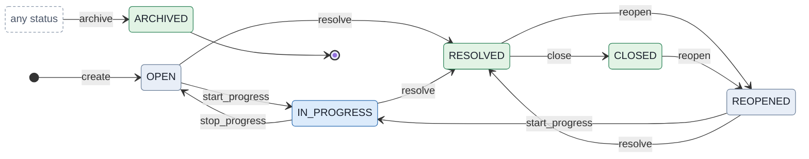

```yaml
module: jira_classic
categories: [todo, in_progress, closed]

enumerations:
  Resolution: [DONE, WONT_DO, DUPLICATE, CANNOT_REPRODUCE]

types:
  WorkItem:
    description: A work item of a company-managed space on the default Jira workflow, whose resolution is chosen on a screen.
    tracking: record

    attributes:
      summary:    { type: string }
      resolution: { type: Resolution, optional: true }

    states:
      OPEN:        { category: todo }
      IN_PROGRESS: { category: in_progress }
      RESOLVED:
        category: closed
        description: A resolution has been taken, awaiting verification by the reporter.
        required_attributes: [resolution]
      REOPENED:
        category: todo
        description: Once resolved, but the resolution was deemed incorrect.
      CLOSED:
        category: closed
        description: Finished, the resolution correct; it can still be reopened.
        required_attributes: [resolution]
      ARCHIVED:    { category: closed, final: true }

    transitions:
      create:
        kind: initial
        to: OPEN
        required_inputs: [summary]
      start_progress:
        kind: external
        from: [OPEN, REOPENED]
        to: IN_PROGRESS
      stop_progress:
        kind: external
        from: IN_PROGRESS
        to: OPEN
      resolve:
        kind: external
        from: [OPEN, IN_PROGRESS, REOPENED]
        to: RESOLVED
        description: Resolves the work item on the Resolve screen, which asks for its resolution.
        required_inputs: [resolution]
      close:
        kind: external
        from: RESOLVED
        to: CLOSED
        description: Closes a resolved work item once its resolution is verified.
      reopen:
        kind: external
        from: [RESOLVED, CLOSED]
        to: REOPENED
        description: Reopens the work item on the Reopen screen, clearing the resolution that was deemed incorrect.
        effect:
          - clear: [resolution]
      archive:
        kind: external
        from: any
        to: ARCHIVED
        description: Archives the work item, which can then no longer be edited.
```

The Resolve screen is `resolve`'s required input, and Resolved and Closed require a resolution, so no work item is there without one.

### 1.5 A web development team's workflow

Atlassian's guide to team-managed workflows builds this one as its example, a web development team's, with hand-off dates, role restrictions and a rule on the way into Done. It is not a template's default.

**Source.** [Set up a workflow in a team-managed software space](https://support.atlassian.com/jira-software-cloud/docs/set-up-a-workflow-in-a-team-managed-software-project/) states the statuses, the transitions between them in order, and their rules:
- "For work items moving to To do → In progress, update the Handed to development field to the current date/time." ([Set up a workflow](https://support.atlassian.com/jira-software-cloud/docs/set-up-a-workflow-in-a-team-managed-software-project/)), and likewise for code review and the QA champion;
- "For work items moving from In code review → In staging, restrict who can move the work item to the role Software engineer." ([Set up a workflow](https://support.atlassian.com/jira-software-cloud/docs/set-up-a-workflow-in-a-team-managed-software-project/)), and to Quality assurance into testing in production;
- "Now work can only move to Done if the most recent status was Testing in production." ([Set up a workflow](https://support.atlassian.com/jira-software-cloud/docs/set-up-a-workflow-in-a-team-managed-software-project/)) The page configures the rule with another status just before, "Select In staging for which status it should go through." ([Set up a workflow](https://support.atlassian.com/jira-software-cloud/docs/set-up-a-workflow-in-a-team-managed-software-project/)); the flow follows the sentence that states the rule.
- Chosen here: the transitions' names, which the page does not give.

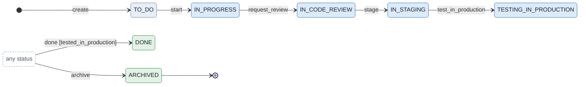

```yaml
module: jira_web_development
categories: [todo, in_progress, closed]

types:
  WorkItem:
    description: A work item of a web development team, on the workflow Atlassian's team-managed guide builds as its example.
    tracking: record

    attributes:
      summary:               { type: string }
      handed_to_development: { type: timestamp, optional: true }
      handed_to_code_review: { type: timestamp, optional: true }
      handed_to_qa_champion: { type: timestamp, optional: true }

    states:
      TO_DO:                 { category: todo }
      IN_PROGRESS:           { category: in_progress }
      IN_CODE_REVIEW:        { category: in_progress }
      IN_STAGING:            { category: in_progress }
      TESTING_IN_PRODUCTION: { category: in_progress }
      DONE:                  { category: closed }
      ARCHIVED:              { category: closed, final: true }

    conditions:
      tested_in_production:
        description: The work item's most recent status is Testing in production.
        expression: state == TESTING_IN_PRODUCTION
        remedy: unreachable_from_here

    transitions:
      create:
        kind: initial
        to: TO_DO
        required_inputs: [summary]
      start:
        kind: external
        from: TO_DO
        to: IN_PROGRESS
        description: Hands the work item to development, stamping when.
        effect:
          - assign: { location: handed_to_development, expr: now }
      request_review:
        kind: external
        from: IN_PROGRESS
        to: IN_CODE_REVIEW
        description: Hands the work item to code review, stamping when.
        effect:
          - assign: { location: handed_to_code_review, expr: now }
      stage:
        kind: external
        from: IN_CODE_REVIEW
        to: IN_STAGING
        description: Hands the work item to the QA champion in staging, stamping when; the space lets only a software engineer take it.
        effect:
          - assign: { location: handed_to_qa_champion, expr: now }
      test_in_production:
        kind: external
        from: IN_STAGING
        to: TESTING_IN_PRODUCTION
        description: Moves the work item to testing in production; the space lets only quality assurance take it.
      done:
        kind: external
        from: any
        to: DONE
        description: Moves the work item to Done, from any status, but only straight from testing in production.
        guards:
          tested_in_production: deny
      archive:
        kind: external
        from: any
        to: ARCHIVED
        description: Archives the work item, which can then no longer be edited.
```

The hand-off dates are `assign` steps of `now`. The role restrictions are the upper layer's (ADR-0114), so the flow names them only in the transitions' descriptions. The rule into Done is a guard on a transition from any status, as Jira has it; since a guard is evaluated before the transition's writes, `state` is the most recent status.

### 1.6 Sprints

A Scrum board's sprints have a lifecycle of their own, which the Jira Software REST API states whole.

**Source.**
- States and transitions, stated: "A sprint can be started by updating the state to 'active'. This requires the sprint to be in the 'future' state and have a startDate and endDate set." ([Jira Software REST API: sprint](https://developer.atlassian.com/cloud/jira/software/rest/api-group-sprint/)) "A sprint can be completed by updating the state to 'closed'. This action requires the sprint to be in the 'active' state. This sets the completeDate to the time of the request." ([Jira Software REST API: sprint](https://developer.atlassian.com/cloud/jira/software/rest/api-group-sprint/)) "Other changes to state are not allowed." ([Jira Software REST API: sprint](https://developer.atlassian.com/cloud/jira/software/rest/api-group-sprint/))
- Rules, stated: "Before you can complete a sprint, all sub-tasks must be marked as Done." ([Complete a sprint](https://support.atlassian.com/jira-software-cloud/docs/complete-a-sprint/)) "If a parent work item is not marked as Done, it will be moved to a future sprint or to the Backlog when the sprint is completed." ([Complete a sprint](https://support.atlassian.com/jira-software-cloud/docs/complete-a-sprint/))
- Not drawn: reopening a completed sprint, which the product offers but whose resulting state no page states; with the API's rule, Closed is final here.

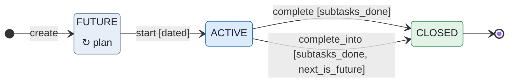

```yaml
module: jira_sprint
categories: [todo, in_progress, closed]

types:
  Sprint:
    description: A sprint of a Scrum board, planned, started once it has dates, and completed only when its subtasks are done.
    tracking: record

    attributes:
      name:          { type: string }
      goal:          { type: string, optional: true }
      start_date:    { type: timestamp, optional: true }
      end_date:      { type: timestamp, optional: true }
      complete_date: { type: timestamp, optional: true }
      work_items:    { reference: "WorkItem[]", opposite: sprint }

    states:
      FUTURE: { category: todo }
      ACTIVE: { category: in_progress }
      CLOSED: { category: closed, final: true }

    conditions:
      dated:
        description: The sprint has a start date and an end date, which plan sets.
        expression: start_date is not null and end_date is not null
        remedy: unreachable_from_here
      next_is_future:
        description: The sprint the unfinished work moves to is another sprint, not yet started.
        expression: inputs.next_sprint != this and inputs.next_sprint.state == Sprint.FUTURE
        remedy: self_serviceable
      subtasks_done:
        description: Every subtask in the sprint is done.
        expression: none(w in work_items where w.parent is not null and w.state.category != closed)
        remedy: dependent

    transitions:
      create:
        kind: initial
        to: FUTURE
        required_inputs: [name]
        optional_inputs: [goal, start_date, end_date]
      plan:
        kind: internal
        from: FUTURE
        description: Sets the sprint's goal or dates before it starts.
        optional_inputs: [goal, start_date, end_date]
      start:
        kind: external
        from: FUTURE
        to: ACTIVE
        guards:
          dated: deny
      complete:
        kind: external
        from: ACTIVE
        to: CLOSED
        description: Completes the sprint, moving each unfinished parent work item to the backlog.
        guards:
          subtasks_done: deny
        effect:
          - assign: { location: complete_date, expr: now }
          - foreach:
              item: w
              array: work_items
              where: w.parent is null and w.state.category != closed
              limit: 500
              steps:
                - call: { target: w, transition: unplan }
      complete_into:
        kind: external
        from: ACTIVE
        to: CLOSED
        description: Completes the sprint, moving each unfinished parent work item to a future sprint.
        inputs:
          next_sprint: { reference: Sprint }
        guards:
          subtasks_done: deny
          next_is_future: deny
        effect:
          - assign: { location: complete_date, expr: now }
          - foreach:
              item: w
              array: work_items
              where: w.parent is null and w.state.category != closed
              limit: 500
              steps:
                - call: { target: w, transition: plan, inputs: { sprint: inputs.next_sprint } }

  WorkItem:
    description: A work item that may be planned into a sprint, a subtask when it has a parent.
    tracking: record

    attributes:
      summary:  { type: string }
      parent:   { reference: WorkItem, optional: true, opposite: subtasks }
      subtasks: { reference: "WorkItem[]", opposite: parent }
      sprint:   { reference: Sprint, optional: true, opposite: work_items }

    states:
      TO_DO:       { category: todo }
      IN_PROGRESS: { category: in_progress }
      DONE:        { category: closed }
      ARCHIVED:    { category: closed, final: true }

    conditions:
      sprint_open:
        description: The sprint the work item is planned into has not been completed.
        expression: inputs.sprint.state != Sprint.CLOSED
        remedy: self_serviceable

    transitions:
      create:
        kind: initial
        to: TO_DO
        required_inputs: [summary]
        optional_inputs: [parent]
      to_do:       { kind: external, from: any, to: TO_DO }
      start:       { kind: external, from: any, to: IN_PROGRESS }
      done:        { kind: external, from: any, to: DONE }
      plan:
        kind: internal
        from: any
        description: Plans the work item into a sprint not yet completed.
        required_inputs: [sprint]
        guards:
          sprint_open: deny
      unplan:
        kind: internal
        from: any
        description: Returns the work item to the backlog.
        effect:
          - clear: [sprint]
      archive:     { kind: external, from: any, to: ARCHIVED }
```

Completing moves each unfinished parent to the backlog, and completing into a future sprint moves them there: two transitions, since the behaviour differs by whether a next sprint is given and no step is conditional (`DESIGN.md` §5.4). The module declares the work items the sprint moves; only the sprint is drawn. *(Corrected 2026-09-27: this section first wrote completing as one transition whose two loops chose by whether the input was given, and cited `case-study-payments.md` §5 for the idiom, which says the opposite: a conditional step is what the model forbids. The recoverability review found it (D409), and step 3 now refuses it (ADR-0122).)*

### 1.7 Versions

A version, the release work is fixed in, is released, archived and deleted, and decides on release what happens to its unresolved work.

**Source.**
- Statuses, stated: "Released — a bundled package" ([View and manage versions](https://support.atlassian.com/jira-software-cloud/docs/view-and-manage-versions-in-business-projects/)), "Unreleased — an open package" ([View and manage versions](https://support.atlassian.com/jira-software-cloud/docs/view-and-manage-versions-in-business-projects/)) and "Archived — a historical snapshot of a package" ([View and manage versions](https://support.atlassian.com/jira-software-cloud/docs/view-and-manage-versions-in-business-projects/)).
- Transitions, stated: releasing, "select the version’s current status (for example, Unreleased) and then select Release." ([Release a version](https://support.atlassian.com/jira-software-cloud/docs/release-a-version-in-your-classic-project/)); unreleasing, "To revert the release of a version, simply select Unrelease" ([View and manage versions](https://support.atlassian.com/jira-software-cloud/docs/view-and-manage-versions-in-business-projects/)); archiving and unarchiving; and deleting, where "You can either move these work items to another version, or simply remove references to the version you want to delete." ([View and manage versions](https://support.atlassian.com/jira-software-cloud/docs/view-and-manage-versions-in-business-projects/))
- Rules, stated: "Choose what to do with any unresolved work items, and enter a release date." ([Release a version](https://support.atlassian.com/jira-software-cloud/docs/release-a-version-in-your-classic-project/))
- Chosen here: archiving from either status, and unarchiving back to the status the version had, told apart by its release date, since no page states where unarchiving leads; unreleasing clears the release date; releasing and deleting are each two transitions, as the choice between moving the work items and not is, and an archived work item, which can no longer be edited, keeps its version.

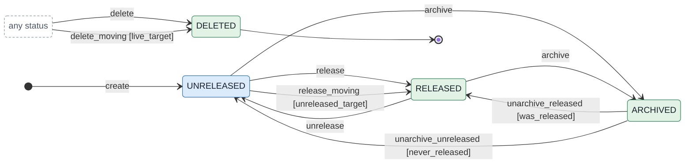

```yaml
module: jira_version
categories: [todo, in_progress, closed]

enumerations:
  Resolution: [DONE, WONT_DO, DUPLICATE, CANNOT_REPRODUCE]

types:
  Version:
    description: A version work is fixed in, released as a bundle, archived as a snapshot, or deleted.
    tracking: record

    attributes:
      name:         { type: string, indexed: true }
      release_date: { type: timestamp, optional: true }
      work_items:   { reference: "WorkItem[]", opposite: fix_version }

    states:
      UNRELEASED: { category: in_progress, description: An open package. }
      RELEASED:   { category: closed, description: A bundled package. }
      ARCHIVED:   { category: closed, description: A historical snapshot of a package. }
      DELETED:    { category: closed, final: true }

    conditions:
      was_released:
        description: The version was released before it was archived.
        expression: release_date is not null
        remedy: unreachable_from_here
      never_released:
        description: The version was not released before it was archived.
        expression: release_date is null
        remedy: unreachable_from_here
      unreleased_target:
        description: The version the unresolved work moves to is another version, not yet released.
        expression: inputs.move_unresolved_to != this and inputs.move_unresolved_to.state == Version.UNRELEASED
        remedy: self_serviceable
      live_target:
        description: The version the work items move to is another version, neither archived nor deleted.
        expression: >-
          inputs.move_to != this
          and (inputs.move_to.state == Version.UNRELEASED or inputs.move_to.state == Version.RELEASED)
        remedy: self_serviceable

    transitions:
      create:
        kind: initial
        to: UNRELEASED
        required_inputs: [name]
      release:
        kind: external
        from: UNRELEASED
        to: RELEASED
        description: Releases the version on its release date, its unresolved work items staying in it.
        required_inputs: [release_date]
      release_moving:
        kind: external
        from: UNRELEASED
        to: RELEASED
        description: Releases the version on its release date, moving its unresolved work items, archived ones aside, to an unreleased version.
        required_inputs: [release_date]
        inputs:
          move_unresolved_to: { reference: Version }
        guards:
          unreleased_target: deny
        effect:
          - foreach:
              item: w
              array: work_items
              where: w.resolution is null and w.state != WorkItem.ARCHIVED
              limit: 1000
              steps:
                - call: { target: w, transition: set_fix_version, inputs: { fix_version: inputs.move_unresolved_to } }
      unrelease:
        kind: external
        from: RELEASED
        to: UNRELEASED
        effect:
          - clear: [release_date]
      archive:
        kind: external
        from: [UNRELEASED, RELEASED]
        to: ARCHIVED
      unarchive_released:
        kind: external
        from: ARCHIVED
        to: RELEASED
        description: Unarchives a version that was released, back to Released.
        guards:
          was_released: deny
      unarchive_unreleased:
        kind: external
        from: ARCHIVED
        to: UNRELEASED
        description: Unarchives a version that was never released, back to Unreleased.
        guards:
          never_released: deny
      delete:
        kind: external
        from: any
        to: DELETED
        description: Deletes the version, removing its work items' reference to it; an archived work item, which can no longer be edited, keeps it.
        effect:
          - foreach:
              item: w
              array: work_items
              where: w.state != WorkItem.ARCHIVED
              limit: 1000
              steps:
                - call: { target: w, transition: clear_fix_version }
      delete_moving:
        kind: external
        from: any
        to: DELETED
        description: Deletes the version, moving its work items, archived ones aside, to another version.
        inputs:
          move_to: { reference: Version }
        guards:
          live_target: deny
        effect:
          - foreach:
              item: w
              array: work_items
              where: w.state != WorkItem.ARCHIVED
              limit: 1000
              steps:
                - call: { target: w, transition: set_fix_version, inputs: { fix_version: inputs.move_to } }

  WorkItem:
    description: A work item that names the version it is fixed in.
    tracking: record

    attributes:
      summary:     { type: string }
      resolution:  { type: Resolution, optional: true }
      fix_version: { reference: Version, optional: true, opposite: work_items }

    states:
      TO_DO:       { category: todo }
      IN_PROGRESS: { category: in_progress }
      DONE:        { category: closed, required_attributes: [resolution] }
      ARCHIVED:    { category: closed, final: true }

    conditions:
      version_live:
        description: The version the work item is fixed in, if one is given, is neither archived nor deleted.
        expression: >-
          inputs.fix_version is null
          or inputs.fix_version.state == Version.UNRELEASED
          or inputs.fix_version.state == Version.RELEASED
        remedy: self_serviceable

    transitions:
      create:
        kind: initial
        to: TO_DO
        required_inputs: [summary]
        optional_inputs: [fix_version]
        guards:
          version_live: deny
      start: { kind: external, from: TO_DO, to: IN_PROGRESS }
      done:
        kind: external
        from: IN_PROGRESS
        to: DONE
        required_inputs: [resolution]
      set_fix_version:
        kind: internal
        from: any
        required_inputs: [fix_version]
        guards:
          version_live: deny
      clear_fix_version:
        kind: internal
        from: any
        effect:
          - clear: [fix_version]
      archive: { kind: external, from: any, to: ARCHIVED }
```

A version's return from Archived to where it was is UML's history pseudostate, which the model does not have; two guarded transitions say it. The optional Bamboo gate, "The version will only be released if the build is successful." ([View and manage versions](https://support.atlassian.com/jira-software-cloud/docs/view-and-manage-versions-in-business-projects/)), would be an evaluator (`flow-format.md` §4.18).

## 2. Jira business templates

The templates of business spaces, formerly Jira Work Management, whose statuses Atlassian states at least in part. Their transitions are the catalogue's throughout, except where noted; the product shows the templates' own.

### 2.1 Task management

The task management template's workflow is the smallest Jira ships, with one rule: a task with open subtasks is not done.

**Source.**
- Statuses, stated: "There are two steps in the workflow: To Do and Done." ([Use business spaces for task management](https://support.atlassian.com/jira-software-cloud/docs/use-business-projects-for-task-management/))
- Rules, stated: "The work item won’t be able to move to Done until all the subtasks are complete as well." ([Use business spaces for task management](https://support.atlassian.com/jira-software-cloud/docs/use-business-projects-for-task-management/)) And a done task is not moved back: "As tempting as it may be to recycle the small recurring tasks, and put them back in To Do, don't." ([Use business spaces for task management](https://support.atlassian.com/jira-software-cloud/docs/use-business-projects-for-task-management/)) "Instead, select More actions (•••) then Clone to create a copy of the issue." ([Use business spaces for task management](https://support.atlassian.com/jira-software-cloud/docs/use-business-projects-for-task-management/))
- Chosen here: subtasks are parts of their task, created under it and archived with it.

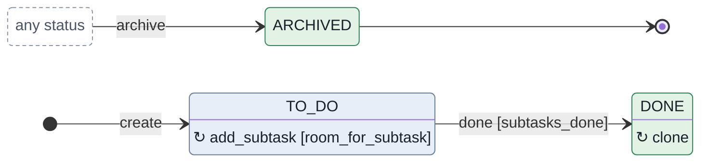

```yaml
module: jira_task_management
categories: [todo, closed]

types:
  Task:
    description: A task of a business space on the task management template, done only when its subtasks are.
    tracking: record

    attributes:
      summary: { type: string }
      subtasks:
        reference: "Subtask[]"
        aggregation: composite
        opposite: task
        cascade:
          - { on: [archive], transition: archive, limit: 100 }

    states:
      TO_DO:    { category: todo }
      DONE:     { category: closed }
      ARCHIVED: { category: closed, final: true }

    conditions:
      room_for_subtask:
        description: The task has fewer than 100 subtasks, the most its archive reaches.
        expression: count(s in subtasks) < 100
        remedy: unreachable_from_here
      subtasks_done:
        description: Every subtask of the task is done.
        expression: none(s in subtasks where s.state != Subtask.DONE)
        remedy: dependent

    transitions:
      create:
        kind: initial
        to: TO_DO
        required_inputs: [summary]
      add_subtask:
        kind: internal
        from: TO_DO
        inputs:
          summary: { type: string }
        guards:
          room_for_subtask: deny
        effect:
          - create: { type: Subtask, transition: add, inputs: { task: this, summary: inputs.summary } }
      done:
        kind: external
        from: TO_DO
        to: DONE
        guards:
          subtasks_done: deny
      clone:
        kind: internal
        from: DONE
        description: Starts the task again as a new task, rather than moving a done one back to To Do.
        effect:
          - create: { type: Task, transition: create, inputs: { summary: summary } }
      archive:
        kind: external
        from: any
        to: ARCHIVED

  Subtask:
    description: A piece of a task, created under it and archived with it.
    tracking: record

    attributes:
      task:    { reference: Task, opposite: subtasks }
      summary: { type: string }

    states:
      TO_DO:    { category: todo }
      DONE:     { category: closed }
      ARCHIVED: { category: closed, final: true }

    transitions:
      add:
        kind: initial
        to: TO_DO
        only_via: [Task.add_subtask]
        required_inputs: [task, summary]
      done:    { kind: external, from: TO_DO, to: DONE }
      archive:
        kind: external
        from: any
        to: ARCHIVED
        only_via: [Task.archive]
```

Cloning is an internal transition that creates a new task from this one; there is no way from Done back to To Do. A task holds at most 100 subtasks, chosen here, since its archive reaches that many and a request that would reach more is refused.

### 2.2 Project management

The project management template starts work and keeps at it until it is complete.

**Source.**
- Statuses, stated: "The workflow has three steps: To do, In Progress, and Done." ([Use business spaces for project management](https://support.atlassian.com/jira-software-cloud/docs/use-business-projects-for-project-management/))
- Transitions, stated in the page's example: "When work commences, move the work item to In Progress." ([Use business spaces for project management](https://support.atlassian.com/jira-software-cloud/docs/use-business-projects-for-project-management/)) and "Move the work item to Done." ([Use business spaces for project management](https://support.atlassian.com/jira-software-cloud/docs/use-business-projects-for-project-management/))

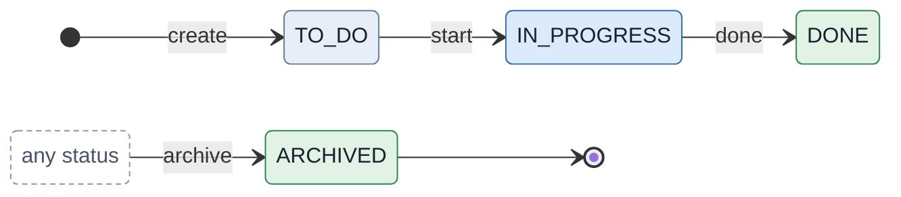

```yaml
module: jira_project_management
categories: [todo, in_progress, closed]

types:
  WorkItem:
    description: A work item of a business space on the project management template, started and worked on until it is complete.
    tracking: record

    attributes:
      summary: { type: string }

    states:
      TO_DO:       { category: todo }
      IN_PROGRESS: { category: in_progress }
      DONE:        { category: closed }
      ARCHIVED:    { category: closed, final: true }

    transitions:
      create:
        kind: initial
        to: TO_DO
        required_inputs: [summary]
      start:
        kind: external
        from: TO_DO
        to: IN_PROGRESS
        description: Moves the work item to In Progress when work commences.
      done:
        kind: external
        from: IN_PROGRESS
        to: DONE
      archive:
        kind: external
        from: any
        to: ARCHIVED
```

### 2.3 Process management

The process management template takes a business case through a manager's review and approval, with several ways to resolve it.

**Source.**
- Statuses and transitions, stated in the page's example: "Start work and move the business case to In Progress." ([Use business spaces for process management](https://support.atlassian.com/jira-software-cloud/docs/use-business-projects-for-process-management/)) "When the case is ready for submission, move it to the Review stage and assign to a manager for approval." ([Use business spaces for process management](https://support.atlassian.com/jira-software-cloud/docs/use-business-projects-for-process-management/))
- Rules, stated: "The workflow includes review and approval steps, and multiple resolution possibilities." ([Use business spaces for process management](https://support.atlassian.com/jira-software-cloud/docs/use-business-projects-for-process-management/)) "The work item won't be able to move to "Done" until all the subtasks are complete as well." ([Use business spaces for process management](https://support.atlassian.com/jira-software-cloud/docs/use-business-projects-for-process-management/)) "Reassign the work item to the approver when it gets moved to review (this can be automated)." ([Use business spaces for process management](https://support.atlassian.com/jira-software-cloud/docs/use-business-projects-for-process-management/))
- Resolutions, stated: "Resolutions Done, Won't Do, Duplicate, and Cannot Reproduce" ([Use business spaces for process management](https://support.atlassian.com/jira-software-cloud/docs/use-business-projects-for-process-management/))
- Chosen here: To Do as the first status, the approval as the transition into Done that carries the resolution, and sending a case back from review.

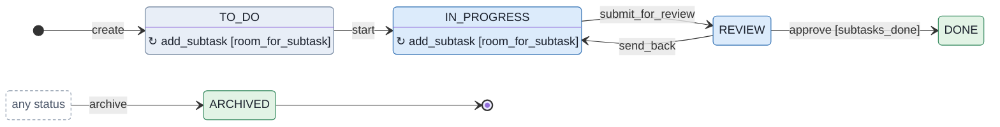

```yaml
module: jira_process_management
imports: { jira_people: [User] }
categories: [todo, in_progress, closed]

enumerations:
  Resolution: [DONE, WONT_DO, DUPLICATE, CANNOT_REPRODUCE]

types:
  Case:
    description: A business case on the process management template, reviewed and approved by a manager, done only when its subtasks are.
    tracking: record

    attributes:
      summary:    { type: string }
      assignee:   { reference: User, optional: true, assignee: true }
      approver:   { reference: User, optional: true }
      resolution: { type: Resolution, optional: true }
      subtasks:
        reference: "Subtask[]"
        aggregation: composite
        opposite: case_item
        cascade:
          - { on: [archive], transition: archive, limit: 100 }

    states:
      TO_DO:       { category: todo }
      IN_PROGRESS: { category: in_progress }
      REVIEW:      { category: in_progress, required_attributes: [approver] }
      DONE:        { category: closed, required_attributes: [resolution] }
      ARCHIVED:    { category: closed, final: true }

    conditions:
      room_for_subtask:
        description: The case has fewer than 100 subtasks, the most its archive reaches.
        expression: count(s in subtasks) < 100
        remedy: unreachable_from_here
      subtasks_done:
        description: Every subtask of the case is done.
        expression: none(s in subtasks where s.state != Subtask.DONE)
        remedy: dependent

    transitions:
      create:
        kind: initial
        to: TO_DO
        required_inputs: [summary]
        optional_inputs: [assignee]
      add_subtask:
        kind: internal
        from: [TO_DO, IN_PROGRESS]
        inputs:
          summary: { type: string }
        guards:
          room_for_subtask: deny
        effect:
          - create: { type: Subtask, transition: add, inputs: { case_item: this, summary: inputs.summary } }
      start:
        kind: external
        from: TO_DO
        to: IN_PROGRESS
      submit_for_review:
        kind: external
        from: IN_PROGRESS
        to: REVIEW
        description: Moves the case to review and assigns it to the manager who approves it.
        required_inputs: [approver]
        effect:
          - assign: { location: assignee, expr: inputs.approver }
      approve:
        kind: external
        from: REVIEW
        to: DONE
        description: Approves the case with one of several resolutions.
        required_inputs: [resolution]
        guards:
          subtasks_done: deny
      send_back:
        kind: external
        from: REVIEW
        to: IN_PROGRESS
      archive:
        kind: external
        from: any
        to: ARCHIVED

  Subtask:
    description: A piece of a case, created under it and archived with it.
    tracking: record

    attributes:
      case_item: { reference: Case, opposite: subtasks }
      summary:   { type: string }

    states:
      TO_DO:    { category: todo }
      DONE:     { category: closed }
      ARCHIVED: { category: closed, final: true }

    transitions:
      add:
        kind: initial
        to: TO_DO
        only_via: [Case.add_subtask]
        required_inputs: [case_item, summary]
      done: { kind: external, from: TO_DO, to: DONE }
      archive:
        kind: external
        from: any
        to: ARCHIVED
        only_via: [Case.archive]
```

The reassignment is written in the transition into review, which assigns the case to the approver it names. A case holds at most 100 subtasks, as a task does (§2.1).

### 2.4 Content management

The content management template drafts marketing content and copy and publishes it.

**Source.**
- Statuses, stated: "For content management and document approval spaces, the work described on the work item is being prepared for review and is considered in progress, in the draft stage of writing." ([Statuses, priorities and resolutions](https://support.atlassian.com/jira-cloud-administration/docs/what-are-issue-statuses-priorities-and-resolutions/)) "For content management spaces, the work described on the work item has been published and/or released for internal consumption. The work is considered done." ([Statuses, priorities and resolutions](https://support.atlassian.com/jira-cloud-administration/docs/what-are-issue-statuses-priorities-and-resolutions/)) The gallery adds the first: "Easily visualize your progress as you move tasks through the workflow — from “to do” to “published”." ([Content management template](https://www.atlassian.com/software/jira/templates/content-management))
- Transitions, chosen here. The review a draft is prepared for has no status the text names, so it is not drawn.

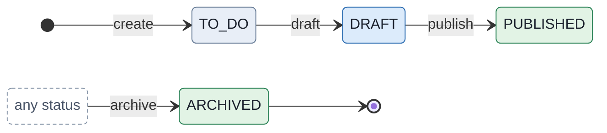

```yaml
module: jira_content_management
categories: [todo, in_progress, closed]

types:
  ContentItem:
    description: A piece of marketing content or copy, drafted and then published.
    tracking: record

    attributes:
      title:        { type: string }
      published_at: { type: timestamp, optional: true }

    states:
      TO_DO:     { category: todo }
      DRAFT:     { category: in_progress, description: "Being prepared for review, in the draft stage of writing." }
      PUBLISHED:
        category: closed
        description: Published or released for internal consumption.
        required_attributes: [published_at]
      ARCHIVED:  { category: closed, final: true }

    transitions:
      create:
        kind: initial
        to: TO_DO
        required_inputs: [title]
      draft:
        kind: external
        from: TO_DO
        to: DRAFT
      publish:
        kind: external
        from: DRAFT
        to: PUBLISHED
        effect:
          - assign: { location: published_at, expr: now }
      archive:
        kind: external
        from: any
        to: ARCHIVED
```

### 2.5 Document approval

The document approval template takes a document through rounds of review.

**Source.**
- Statuses, stated: Draft, as in §2.4, and "For document approval spaces, the work described on the work item has passed its initial review and is being closely proofed for publication." ([Statuses, priorities and resolutions](https://support.atlassian.com/jira-cloud-administration/docs/what-are-issue-statuses-priorities-and-resolutions/)) The gallery adds the ends: "Track each document’s progress as it moves from “to do” through rounds of reviews to “done”." ([Document approval template](https://www.atlassian.com/software/jira/templates/document-approval))
- Chosen here: Review, the initial review Second Review follows, whose name the text does not give, and the transitions, with a way back to the draft from either review.

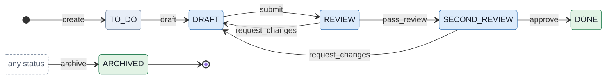

```yaml
module: jira_document_approval
categories: [todo, in_progress, closed]

types:
  Document:
    description: A document that is drafted and then approved through rounds of review.
    tracking: record

    attributes:
      title: { type: string }

    states:
      TO_DO:         { category: todo }
      DRAFT:         { category: in_progress, description: "Being prepared for review, in the draft stage of writing." }
      REVIEW:        { category: in_progress, description: "Under its initial review." }
      SECOND_REVIEW: { category: in_progress, description: "Passed its initial review, being closely proofed for publication." }
      DONE:          { category: closed }
      ARCHIVED:      { category: closed, final: true }

    transitions:
      create:
        kind: initial
        to: TO_DO
        required_inputs: [title]
      draft:
        kind: external
        from: TO_DO
        to: DRAFT
      submit:
        kind: external
        from: DRAFT
        to: REVIEW
      pass_review:
        kind: external
        from: REVIEW
        to: SECOND_REVIEW
      approve:
        kind: external
        from: SECOND_REVIEW
        to: DONE
      request_changes:
        kind: external
        from: [REVIEW, SECOND_REVIEW]
        to: DRAFT
        description: Sends the document back to its author for another draft.
      archive:
        kind: external
        from: any
        to: ARCHIVED
```

### 2.6 Recruitment

The recruitment template follows a candidate from application to an accepted offer.

**Source.**
- Statuses, stated one by one on [Statuses, priorities and resolutions](https://support.atlassian.com/jira-cloud-administration/docs/what-are-issue-statuses-priorities-and-resolutions/), for example "For recruitment spaces, this indicates that the candidate has completed interviewing and interviewers are discussing their next steps in the hiring process." ([Statuses, priorities and resolutions](https://support.atlassian.com/jira-cloud-administration/docs/what-are-issue-statuses-priorities-and-resolutions/)) and "For recruitment spaces, this indicates that the candidate has accepted the position. The work item is considered done." ([Statuses, priorities and resolutions](https://support.atlassian.com/jira-cloud-administration/docs/what-are-issue-statuses-priorities-and-resolutions/))
- Chosen here: Rejected, since the text names no status for a candidate turned down, and the transitions.

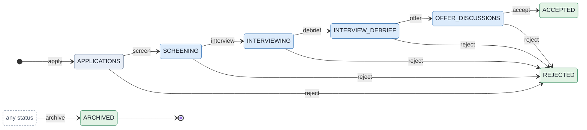

```yaml
module: jira_recruitment
categories: [todo, in_progress, closed]

types:
  Candidate:
    description: A candidate for a position, from their application to an accepted offer or a rejection.
    tracking: record

    attributes:
      name:     { type: string, optional: true, personal: true }
      position: { type: string }

    states:
      APPLICATIONS:      { category: todo, description: "Applied, waiting to be screened." }
      SCREENING:         { category: in_progress, description: "Being considered for interviews." }
      INTERVIEWING:      { category: in_progress }
      INTERVIEW_DEBRIEF: { category: in_progress, description: "Interviewed; the interviewers are discussing next steps." }
      OFFER_DISCUSSIONS: { category: in_progress, description: "Offered the position; the details are being settled." }
      ACCEPTED:          { category: closed, description: "Accepted the position." }
      REJECTED:          { category: closed }
      ARCHIVED:          { category: closed, final: true }

    transitions:
      apply:
        kind: initial
        to: APPLICATIONS
        required_inputs: [position]
        optional_inputs: [name]
      screen:
        kind: external
        from: APPLICATIONS
        to: SCREENING
      interview:
        kind: external
        from: SCREENING
        to: INTERVIEWING
      debrief:
        kind: external
        from: INTERVIEWING
        to: INTERVIEW_DEBRIEF
      offer:
        kind: external
        from: INTERVIEW_DEBRIEF
        to: OFFER_DISCUSSIONS
      accept:
        kind: external
        from: OFFER_DISCUSSIONS
        to: ACCEPTED
      reject:
        kind: external
        from: [APPLICATIONS, SCREENING, INTERVIEWING, INTERVIEW_DEBRIEF, OFFER_DISCUSSIONS]
        to: REJECTED
      archive:
        kind: external
        from: any
        to: ARCHIVED
      forget:
        kind: erasure
        description: Erases the candidate's name, on a request to be forgotten.
        inputs:
          reason: { type: string }
```

A candidate's name is personal, so it is optional and erasable (`flow-format.md` §4.13).

### 2.7 Lead tracking

The lead tracking template follows a sales lead to a won or a lost deal.

**Source.**
- Statuses, stated one by one on [Statuses, priorities and resolutions](https://support.atlassian.com/jira-cloud-administration/docs/what-are-issue-statuses-priorities-and-resolutions/), for example "For lead tracking spaces, this indicates that the sales team is adjusting their terms to make a sale." ([Statuses, priorities and resolutions](https://support.atlassian.com/jira-cloud-administration/docs/what-are-issue-statuses-priorities-and-resolutions/)) and "For lead tracking spaces, this indicates that the lead was unsuccessful. The work item is considered done." ([Statuses, priorities and resolutions](https://support.atlassian.com/jira-cloud-administration/docs/what-are-issue-statuses-priorities-and-resolutions/))
- Transitions, chosen here: the stages in order, and a lead lost from any of them.

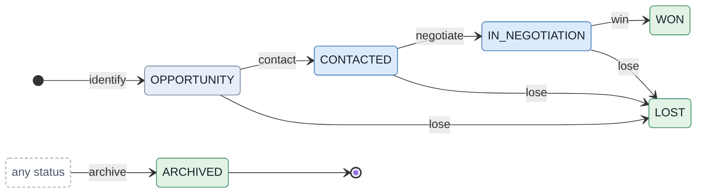

```yaml
module: jira_lead_tracking
categories: [todo, in_progress, closed]

types:
  Lead:
    description: A sales lead, from an identified opportunity to a won or lost deal.
    tracking: record

    attributes:
      company: { type: string }

    states:
      OPPORTUNITY:    { category: todo, description: "An opportunity the sales team wants to pursue." }
      CONTACTED:      { category: in_progress, description: "The lead has been contacted and the pitch is in progress." }
      IN_NEGOTIATION: { category: in_progress, description: "The terms are being adjusted to make a sale." }
      WON:            { category: closed }
      LOST:           { category: closed }
      ARCHIVED:       { category: closed, final: true }

    transitions:
      identify:
        kind: initial
        to: OPPORTUNITY
        required_inputs: [company]
      contact:
        kind: external
        from: OPPORTUNITY
        to: CONTACTED
      negotiate:
        kind: external
        from: CONTACTED
        to: IN_NEGOTIATION
      win:
        kind: external
        from: IN_NEGOTIATION
        to: WON
      lose:
        kind: external
        from: [OPPORTUNITY, CONTACTED, IN_NEGOTIATION]
        to: LOST
      archive:
        kind: external
        from: any
        to: ARCHIVED
```

### 2.8 Procurement

The procurement template takes a request for a service or an item to its purchase.

**Source.**
- Statuses, stated: "For procurement spaces, this indicates that the service or item has been requested and is waiting for a procurement team member to action the request." ([Statuses, priorities and resolutions](https://support.atlassian.com/jira-cloud-administration/docs/what-are-issue-statuses-priorities-and-resolutions/)) "For procurement spaces, this indicates that the service or item was purchased. The work item is considered done." ([Statuses, priorities and resolutions](https://support.atlassian.com/jira-cloud-administration/docs/what-are-issue-statuses-priorities-and-resolutions/))
- Transitions, chosen here. The gallery expects the flow to be extended: "Tailor your procurement workflow to reflect your team’s unique purchase process." ([Procurement template](https://www.atlassian.com/software/jira/templates/procurement)); an approval before the purchase would be written as the approvals case study writes one (`case-study-approvals-and-bookings.md`, appendix).

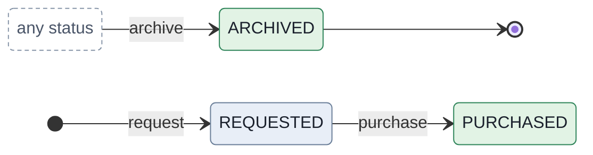

```yaml
module: jira_procurement
categories: [todo, closed]

types:
  PurchaseRequest:
    description: A request for a service or an item, which a procurement team member actions by buying it.
    tracking: record

    attributes:
      item:         { type: string }
      purchased_at: { type: timestamp, optional: true }

    states:
      REQUESTED: { category: todo, description: "Waiting for a procurement team member to action the request." }
      PURCHASED: { category: closed, required_attributes: [purchased_at] }
      ARCHIVED:  { category: closed, final: true }

    transitions:
      request:
        kind: initial
        to: REQUESTED
        required_inputs: [item]
      purchase:
        kind: external
        from: REQUESTED
        to: PURCHASED
        effect:
          - assign: { location: purchased_at, expr: now }
      archive:
        kind: external
        from: any
        to: ARCHIVED
```

## 3. Jira Service Management

The service flows: a request on the default IT support workflow, a service request with an approval, and the incident, problem and change workflows of the IT service management template. Atlassian names these workflows' statuses in part; where the catalogue completes them, it takes the names from the statuses Jira Service Management ships, which [Statuses, priorities and resolutions](https://support.atlassian.com/jira-cloud-administration/docs/what-are-issue-statuses-priorities-and-resolutions/) lists: Waiting for approval, Awaiting CAB approval, Work in progress, Pending, Escalated, Under investigation, Completed, Canceled and others. The model starts no transition by itself, so where Jira's automation closes or approves, an application requests the transition (PRD F8).

### 3.1 A request on the IT support workflow

Every new service space gets the Jira Service Management IT Support Workflow, and its requests are closed by the service desk or automatically.

**Source.**
- Statuses, stated: "Waiting for Triage The initial status when requests are created." ([Default configurations](https://support.atlassian.com/jira-cloud-administration/docs/default-configurations-for-jira-service-management/)) Waiting for Support comes "After requests have been triaged and each time the customer/reporter is waiting for a response." ([Default configurations](https://support.atlassian.com/jira-cloud-administration/docs/default-configurations-for-jira-service-management/)), and Waiting for Customer "After an agent has actioned a request and is waiting for a response from the customer/reporter." ([Default configurations](https://support.atlassian.com/jira-cloud-administration/docs/default-configurations-for-jira-service-management/)), which the transitions follow.
- Rules, stated: "After resolving the request, the service space agent closes the request or waits for the service space to automatically close the request." ([Service request workflows](https://support.atlassian.com/jira-service-management-cloud/docs/what-service-request-workflows-come-with-my-service-project/)) "Together, these automatically close service requests three business days after an agent resolves them." ([Auto-close resolved service requests](https://support.atlassian.com/jira-service-management-cloud/docs/auto-close-resolved-service-requests/)) "The SLA called Time to close after resolution starts a clock when the resolution field of a service request is set." ([Auto-close resolved service requests](https://support.atlassian.com/jira-service-management-cloud/docs/auto-close-resolved-service-requests/))
- Chosen here: Closed, which the automation names, as final, and three days of absolute time rather than business days, since working-hours calendars are a non-goal (PRD revision 11).

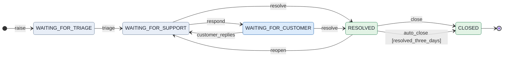

```yaml
module: jsm_it_support
imports: { jira_people: [User] }
categories: [todo, in_progress, closed]

enumerations:
  Resolution: [DONE, WONT_DO, DUPLICATE]

types:
  Request:
    description: A customer's request on the Jira Service Management IT Support Workflow, closed by the service desk or automatically three days after it is resolved.
    tracking: record

    attributes:
      summary:     { type: string }
      reporter:    { reference: User }
      resolution:  { type: Resolution, optional: true }
      resolved_at: { type: timestamp, optional: true }

    states:
      WAITING_FOR_TRIAGE:   { category: todo, description: "The initial status when requests are created." }
      WAITING_FOR_SUPPORT:  { category: todo }
      WAITING_FOR_CUSTOMER: { category: in_progress }
      RESOLVED:
        category: closed
        required_attributes: [resolution, resolved_at]
      CLOSED:               { category: closed, final: true }

    conditions:
      resolved_three_days:
        description: The request was resolved at least three days ago, when Time to close after resolution is breached.
        expression: resolved_at + 3 days <= now
        remedy: temporal

    transitions:
      raise:
        kind: initial
        to: WAITING_FOR_TRIAGE
        required_inputs: [summary, reporter]
      triage:
        kind: external
        from: WAITING_FOR_TRIAGE
        to: WAITING_FOR_SUPPORT
      respond:
        kind: external
        from: WAITING_FOR_SUPPORT
        to: WAITING_FOR_CUSTOMER
        description: The service desk replies and waits for the customer.
      customer_replies:
        kind: external
        from: WAITING_FOR_CUSTOMER
        to: WAITING_FOR_SUPPORT
      resolve:
        kind: external
        from: [WAITING_FOR_SUPPORT, WAITING_FOR_CUSTOMER]
        to: RESOLVED
        required_inputs: [resolution]
        effect:
          - assign: { location: resolved_at, expr: now }
      reopen:
        kind: external
        from: RESOLVED
        to: WAITING_FOR_SUPPORT
        description: Reopens the request, clearing its resolution, which stops the clock on closing it.
        effect:
          - clear: [resolution, resolved_at]
      close:
        kind: external
        from: RESOLVED
        to: CLOSED
        description: The service desk closes the resolved request.
      auto_close:
        kind: external
        from: RESOLVED
        to: CLOSED
        description: Closes the request once Time to close after resolution is breached; the automation requests it.
        guards:
          resolved_three_days: deny
```

Two transitions close a resolved request: `close`, the service desk's, and `auto_close`, which the automation requests and a `temporal` guard holds until three days have passed. Reopening clears the resolution, which stops the clock, as the SLA's stop condition says.

### 3.2 A service request with an approval

The IT service management template's fulfilment workflow with approvals holds a request for its approvers before it is worked on.

**Source.**
- Stated: "this workflow includes an approval step." ([Service request workflows](https://support.atlassian.com/jira-service-management-cloud/docs/what-service-request-workflows-come-with-my-service-project/)) "The request transitions to a status that has an approval step." ([What are approvals?](https://support.atlassian.com/jira-service-management-cloud/docs/what-are-approvals/)) "Note: This option is only available if the workflow status has at least two transitions: one for Approve, and one for Decline." ([Add an approval to a workflow](https://support.atlassian.com/jira-service-management-cloud/docs/add-an-approval-to-a-workflow/)) "Select the statuses to transition to if the work item is approved or declined." ([Add an approval to a workflow](https://support.atlassian.com/jira-service-management-cloud/docs/add-an-approval-to-a-workflow/))
- Chosen here: Waiting for approval as the status with the approval step, Waiting for support after an approval, and Declined, final, after a decline; the rest as in §3.1.

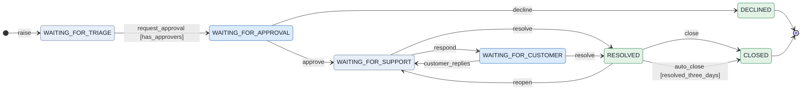

```yaml
module: jsm_service_request_approvals
imports: { jira_people: [User] }
categories: [todo, in_progress, closed]

enumerations:
  Resolution: [DONE, WONT_DO, DUPLICATE]

types:
  Request:
    description: A service request on the fulfilment workflow with an approval step, approved or declined before it is worked on.
    tracking: record

    attributes:
      summary:     { type: string }
      reporter:    { reference: User }
      approved_by: { type: identity, optional: true }
      resolution:  { type: Resolution, optional: true }
      resolved_at: { type: timestamp, optional: true }

    states:
      WAITING_FOR_TRIAGE:   { category: todo }
      WAITING_FOR_APPROVAL: { category: in_progress }
      WAITING_FOR_SUPPORT:  { category: todo }
      WAITING_FOR_CUSTOMER: { category: in_progress }
      RESOLVED:
        category: closed
        required_attributes: [resolution, resolved_at]
      DECLINED:             { category: closed, final: true }
      CLOSED:               { category: closed, final: true }

    conditions:
      has_approvers:
        description: At least one approver is named for the request.
        expression: count(a in inputs.approvers) >= 1
        remedy: self_serviceable
      resolved_three_days:
        description: The request was resolved at least three days ago, when Time to close after resolution is breached.
        expression: resolved_at + 3 days <= now
        remedy: temporal

    transitions:
      raise:
        kind: initial
        to: WAITING_FOR_TRIAGE
        required_inputs: [summary, reporter]
      request_approval:
        kind: external
        from: WAITING_FOR_TRIAGE
        to: WAITING_FOR_APPROVAL
        description: Moves the request to the status with the approval step, naming its approvers, who are recorded with the event and notified.
        inputs:
          approvers: { reference: "User[]" }
        guards:
          has_approvers: deny
      approve:
        kind: external
        from: WAITING_FOR_APPROVAL
        to: WAITING_FOR_SUPPORT
        description: The approval step's Approve transition, recording who approved.
        effect:
          - assign: { location: approved_by, expr: actor.id }
      decline:
        kind: external
        from: WAITING_FOR_APPROVAL
        to: DECLINED
        description: The approval step's Decline transition.
      respond:
        kind: external
        from: WAITING_FOR_SUPPORT
        to: WAITING_FOR_CUSTOMER
      customer_replies:
        kind: external
        from: WAITING_FOR_CUSTOMER
        to: WAITING_FOR_SUPPORT
      resolve:
        kind: external
        from: [WAITING_FOR_SUPPORT, WAITING_FOR_CUSTOMER]
        to: RESOLVED
        required_inputs: [resolution]
        effect:
          - assign: { location: resolved_at, expr: now }
      reopen:
        kind: external
        from: RESOLVED
        to: WAITING_FOR_SUPPORT
        effect:
          - clear: [resolution, resolved_at]
      close:
        kind: external
        from: RESOLVED
        to: CLOSED
      auto_close:
        kind: external
        from: RESOLVED
        to: CLOSED
        guards:
          resolved_three_days: deny
```

The approval step is the two transitions out of Waiting for approval. The approvers are named as an input, recorded with the event and notified by the application; who may approve is the upper layer's, and `approve` records who did, `actor.id` being the one value a flow may read of the actor (`flow-format.md` §5).

### 3.3 Incidents

The IT service management template's incident workflow escalates an incident when needed and closes it automatically once it is resolved.

**Source.**
- Stated: "If needed, the service space team escalates the incident to second-line support representatives." ([The incident management workflow](https://support.atlassian.com/jira-service-management-cloud/docs/the-incident-management-workflow-for-service-projects/)) "The service space automatically closes the incident." ([The incident management workflow](https://support.atlassian.com/jira-service-management-cloud/docs/the-incident-management-workflow-for-service-projects/)) "This flow transitions an incident from Resolved to Closed when the above SLA is breached." ([Auto-close incidents](https://support.atlassian.com/jira-service-management-cloud/docs/auto-close-incidents-after-they-are-resolved/))
- Chosen here: Open, Work in progress, Pending, Escalated and Canceled, from the statuses Jira Service Management ships, and the transitions between them.

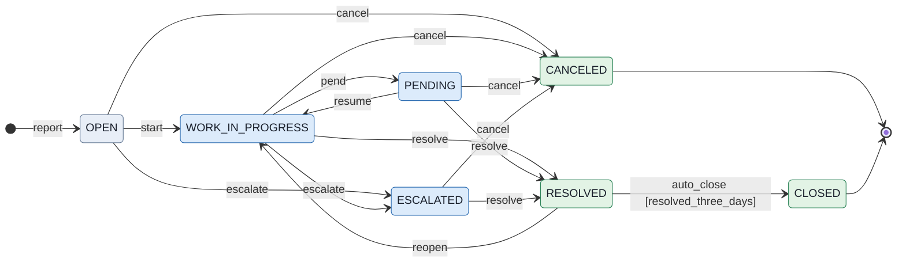

```yaml
module: jsm_incident
categories: [todo, in_progress, closed]

enumerations:
  Resolution: [DONE, WONT_DO, DUPLICATE, KNOWN_ERROR, HARDWARE_FAILURE, SOFTWARE_FAILURE]

types:
  Incident:
    description: An incident on the IT service management template's incident workflow, escalated when needed and closed automatically after it is resolved.
    tracking: record

    attributes:
      summary:     { type: string }
      resolution:  { type: Resolution, optional: true }
      resolved_at: { type: timestamp, optional: true }

    states:
      OPEN:             { category: todo }
      WORK_IN_PROGRESS: { category: in_progress }
      PENDING:          { category: in_progress }
      ESCALATED:        { category: in_progress, description: "With second-line support." }
      RESOLVED:
        category: closed
        required_attributes: [resolution, resolved_at]
      CANCELED:         { category: closed, final: true }
      CLOSED:           { category: closed, final: true }

    conditions:
      resolved_three_days:
        description: The incident was resolved at least three days ago, when Time to close after resolution is breached.
        expression: resolved_at + 3 days <= now
        remedy: temporal

    transitions:
      report:
        kind: initial
        to: OPEN
        required_inputs: [summary]
      start:
        kind: external
        from: OPEN
        to: WORK_IN_PROGRESS
      pend:
        kind: external
        from: WORK_IN_PROGRESS
        to: PENDING
      resume:
        kind: external
        from: PENDING
        to: WORK_IN_PROGRESS
      escalate:
        kind: external
        from: [OPEN, WORK_IN_PROGRESS]
        to: ESCALATED
        description: Escalates the incident to second-line support.
      resolve:
        kind: external
        from: [WORK_IN_PROGRESS, PENDING, ESCALATED]
        to: RESOLVED
        required_inputs: [resolution]
        effect:
          - assign: { location: resolved_at, expr: now }
      reopen:
        kind: external
        from: RESOLVED
        to: WORK_IN_PROGRESS
        effect:
          - clear: [resolution, resolved_at]
      cancel:
        kind: external
        from: [OPEN, WORK_IN_PROGRESS, PENDING, ESCALATED]
        to: CANCELED
      auto_close:
        kind: external
        from: RESOLVED
        to: CLOSED
        description: Closes the incident once Time to close after resolution is breached; the automation requests it.
        guards:
          resolved_three_days: deny
```

The resolutions are the ones every Jira product has and the three Jira Service Management adds, among them Known error.

### 3.4 Problems

The problem workflow investigates a problem's root cause and workaround, and ends in a status nothing leaves.

**Source.**
- Stated: "The CLOSED status lacks an outgoing transition, preventing reopened issues." ([Modify a workflow to allow reopening](https://support.atlassian.com/jira/kb/how-to-modify-your-workflow-to-allow-issues-to-be-reopened/)) "Known error The problem has a documented root cause and a work around." ([Statuses, priorities and resolutions](https://support.atlassian.com/jira-cloud-administration/docs/what-are-issue-statuses-priorities-and-resolutions/))
- Chosen here: Open, which the same article names, Under investigation, Completed and Canceled, from the statuses Jira Service Management ships, and the transitions.

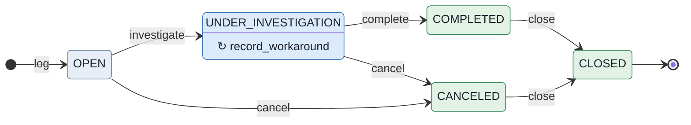

```yaml
module: jsm_problem
categories: [todo, in_progress, closed]

enumerations:
  Resolution: [DONE, WONT_DO, DUPLICATE, KNOWN_ERROR]

types:
  Problem:
    description: A problem on the IT service management template's problem workflow, investigated for its root cause and a workaround, and closed for good.
    tracking: record

    attributes:
      summary:    { type: string }
      root_cause: { type: string, optional: true }
      workaround: { type: string, optional: true }
      resolution: { type: Resolution, optional: true }

    states:
      OPEN:                { category: todo }
      UNDER_INVESTIGATION: { category: in_progress }
      COMPLETED:
        category: closed
        required_attributes: [root_cause, resolution]
      CANCELED:            { category: closed }
      CLOSED:              { category: closed, final: true, description: "It has no outgoing transition." }

    transitions:
      log:
        kind: initial
        to: OPEN
        required_inputs: [summary]
      investigate:
        kind: external
        from: OPEN
        to: UNDER_INVESTIGATION
      record_workaround:
        kind: internal
        from: UNDER_INVESTIGATION
        required_inputs: [workaround]
      complete:
        kind: external
        from: UNDER_INVESTIGATION
        to: COMPLETED
        description: Completes the problem with its root cause and a resolution, such as Known error.
        required_inputs: [root_cause, resolution]
      cancel:
        kind: external
        from: [OPEN, UNDER_INVESTIGATION]
        to: CANCELED
      close:
        kind: external
        from: [COMPLETED, CANCELED]
        to: CLOSED
```

Closed is final, as the article says of it. A completed problem carries its root cause, which `complete` requires.

### 3.5 Changes

The change workflow reviews a change twice, by a change manager or a peer and by the change advisory board, before it is implemented.

**Source.**
- Stated: "The workflow includes two review stages:" ([Enforce an approval step for change reviews](https://support.atlassian.com/jira-service-management-cloud/docs/enforce-an-approval-step-for-change-reviews/)) "It transitions these through the Peer review / Change manager approval stage to the Planning stage." ([Auto-approve standard changes](https://support.atlassian.com/jira-service-management-cloud/docs/auto-approve-standard-changes/)), for changes "that have the Change type set to Standard." ([Auto-approve standard changes](https://support.atlassian.com/jira-service-management-cloud/docs/auto-approve-standard-changes/)) "By default, the change management workflow doesn't force approvals for these steps." ([Enforce an approval step for change reviews](https://support.atlassian.com/jira-service-management-cloud/docs/enforce-an-approval-step-for-change-reviews/)) For deployment gating, "If you’re using the default change management workflow, we recommend selecting Implementing." ([Set up deployment gating](https://support.atlassian.com/jira-service-management-cloud/docs/set-up-deployment-gating/)), and Declined when a deployment is prevented.
- Chosen here: Awaiting CAB approval and Awaiting implementation from the statuses Jira Service Management ships, Completed and Canceled as final, and the transitions. The change types are those of `case-study-tickets.md` §7.6.

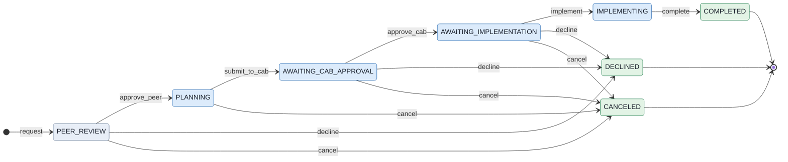

```yaml
module: jsm_change
categories: [todo, in_progress, closed]

enumerations:
  ChangeType: [STANDARD, NORMAL, EMERGENCY]

types:
  Change:
    description: A change on the IT service management template's change workflow, reviewed by a change manager or a peer and by the change advisory board before it is implemented.
    tracking: record

    attributes:
      summary:     { type: string }
      change_type: { type: ChangeType }

    states:
      PEER_REVIEW:             { category: todo, description: "Peer review / change manager approval." }
      PLANNING:                { category: in_progress }
      AWAITING_CAB_APPROVAL:   { category: in_progress }
      AWAITING_IMPLEMENTATION: { category: in_progress }
      IMPLEMENTING:            { category: in_progress }
      COMPLETED:               { category: closed, final: true }
      DECLINED:                { category: closed, final: true }
      CANCELED:                { category: closed, final: true }

    transitions:
      request:
        kind: initial
        to: PEER_REVIEW
        required_inputs: [summary, change_type]
      approve_peer:
        kind: external
        from: PEER_REVIEW
        to: PLANNING
        description: Passes the change manager or peer review; for a standard change, the application's automation requests it, and no approval is enforced.
      submit_to_cab:
        kind: external
        from: PLANNING
        to: AWAITING_CAB_APPROVAL
      approve_cab:
        kind: external
        from: AWAITING_CAB_APPROVAL
        to: AWAITING_IMPLEMENTATION
      implement:
        kind: external
        from: AWAITING_IMPLEMENTATION
        to: IMPLEMENTING
        description: Starts the implementation; with deployment gating, the application requests it when the deployment is allowed.
      complete:
        kind: external
        from: IMPLEMENTING
        to: COMPLETED
      decline:
        kind: external
        from: [PEER_REVIEW, AWAITING_CAB_APPROVAL, AWAITING_IMPLEMENTATION]
        to: DECLINED
        description: Declines the change at a review, or, with deployment gating, when the application finds the deployment prevented.
      cancel:
        kind: external
        from: [PEER_REVIEW, PLANNING, AWAITING_CAB_APPROVAL, AWAITING_IMPLEMENTATION]
        to: CANCELED
```

The reviews are transitions without an approval guard, as the default workflow forces none; an approval would be enforced by a guard, as `servicedesk.yaml`'s `approve_cab` does (`case-study-tickets.md` §7.6).

## 4. What writing the catalogue found

- **D394.** A description with a comma inside an inline mapping was cut in two, and step 2 reported only an unexpected key; the checker now says that a value was cut at a comma and cites `flow-format.md` §2 rule 4.
- **A return to where an object was is two transitions.** A version unarchived goes back to Released or Unreleased, whichever it was. UML writes that with a history pseudostate, which the model does not have, and the flow writes it with two transitions guarded on what the version recorded (§1.7). No other flow needed it.
- **Jira's free movement is `from: any`.** Every simplified and team-managed workflow is written with one transition into each status, from any status. Drawn as edges from every status, the free-moving workflows were thickets of edges; drawn from one `any status` node, as Jira's own editor draws them, they read as Jira's do. The first drawing also showed a status with an internal transition under the transition's name instead of its own, which the generator now avoids by naming each such status.
- **What a builder could not recover.** A review on 2026-09-27 gave readers only the specification and the modules (`flow-recoverability-review.md`). It found gaps the specification now closes (ADR-0122), among them that `from: any` left out whether a transition could leave a status for itself, which it now cannot, and defects of this catalogue, each corrected (D409): the sprints' and versions' choices are two transitions each, an archived work item no longer blocks a version's deletion, approvers are an input rather than a set with no way back, a whole's subtasks are bounded by its archive's reach, and a resolution is cleared when work leaves Done.
- **What held.** Every flow Atlassian states in text is written as it states it, and every rule stated beside one is written as a guard, an effect or a required input, except the role restrictions and the automations, which are the upper layer's by design.

## 5. Templates whose workflow the text does not state

These 51 templates and workflows have no status stated in Atlassian's text, so the catalogue does not draw them: each shows its workflow in the product, and the text says only what the template is for. `case-study-tickets.md` §7 writes the IT service management template's post-incident review from the statuses Jira Service Management ships.

| Product | Template | What the text says |
|---|---|---|
| Jira (software) | Bug tracking template | "Each unique work type can have its own custom workflow." ([page](https://support.atlassian.com/jira-software-cloud/docs/what-are-the-project-templates/)) |
| Jira (software) | Agentic engineering template | "The agentic engineering template in Jira provides a ready-made space setup, complete with a workflow optimized for agents like Jira Coding Agent, Claude Code, and GitHub Copilot for Jira, so you can start automating coding tasks from day one." ([page](https://support.atlassian.com/jira-software-cloud/docs/use-the-agentic-engineering-template-to-integrate-coding-agents-in-your-workflow/)) |
| Jira (software) | DevOps (template gallery) | nothing about its workflow |
| Jira (software) | Top-level planning (template gallery) | nothing about its workflow |
| Jira (software) | Cross-team planning (template gallery) | nothing about its workflow |
| Jira (software) | Product discovery template (template gallery) | nothing about its workflow |
| Jira (software) | Product roadmap (template gallery) | nothing about its workflow |
| Jira (software) | Product breakdown structure (template gallery) | nothing about its workflow |
| Jira business templates (formerly Jira Work Management) | Task tracking (template gallery) | "Open Board view to follow tasks through workflow stages such as To do, In progress, and Done so the team can quickly understand the status of work." ([page](https://www.atlassian.com/software/jira/templates/task-tracking)) |
| Jira business templates (formerly Jira Work Management) | Personal task tracker (template gallery) | "Quickly add a task to your to-do list, and feel good as you move it across the board from to-do to done!" ([page](https://www.atlassian.com/software/jira/templates/personal-task-tracker)) |
| Jira business templates (formerly Jira Work Management) | Process control (template gallery) | nothing about its workflow |
| Jira business templates (formerly Jira Work Management) | Campaign management (template gallery) | "Our approval workflow is easy to use and edit to fit your marketing team’s needs and reach your campaign goals." ([page](https://www.atlassian.com/software/jira/templates/campaign-management)) |
| Jira business templates (formerly Jira Work Management) | Go-to-market (template gallery) | "For example, if you’re coordinating a go-to-market launch for your product or business, select the Go-to-Market template to create a space with a pre-configured workflow that follows this process." ([page](https://support.atlassian.com/jira-software-cloud/docs/create-a-business-project/)) |
| Jira business templates (formerly Jira Work Management) | Event planning (template gallery) | "A Kanban board organizes events into columns such as “To Do,” “In Progress,” and “Completed.”" ([page](https://www.atlassian.com/software/jira/templates/event-calendar-template)) |
| Jira business templates (formerly Jira Work Management) | Email campaign (template gallery) | nothing about its workflow |
| Jira business templates (formerly Jira Work Management) | Budget creation (template gallery) | nothing about its workflow |
| Jira business templates (formerly Jira Work Management) | RFP process (template gallery) | nothing about its workflow |
| Jira business templates (formerly Jira Work Management) | Month-end close (template gallery) | nothing about its workflow |
| Jira business templates (formerly Jira Work Management) | Policy management (template gallery) | nothing about its workflow |
| Jira business templates (formerly Jira Work Management) | Work breakdown structure (template gallery) | nothing about its workflow |
| Jira business templates (formerly Jira Work Management) | New employee onboarding (template gallery) | nothing about its workflow |
| Jira business templates (formerly Jira Work Management) | Performance review (template gallery) | nothing about its workflow |
| Jira business templates (formerly Jira Work Management) | IP infringement (template gallery) | nothing about its workflow |
| Jira business templates (formerly Jira Work Management) | Web design process (template gallery) | nothing about its workflow |
| Jira business templates (formerly Jira Work Management) | Asset creation (template gallery) | nothing about its workflow |
| Jira business templates (formerly Jira Work Management) | Sales pipeline (template gallery) | nothing about its workflow |
| Jira (template gallery: Project Management Templates category) | Workflow template (template gallery) | nothing about its workflow |
| Jira (template gallery: Project Management Templates category) | Project board template (template gallery) | nothing about its workflow |
| Jira (template gallery: Project Management Templates category) | Project roadmap template (template gallery) | nothing about its workflow |
| Jira (template gallery: Project Management Templates category) | Agile roadmap template (template gallery) | nothing about its workflow |
| Jira (template gallery: Project Management Templates category) | Project schedule template (template gallery) | "Kanban boards visualize tasks in columns like "To Do," "In Progress," and "Done," creating a clear picture of workflows." ([page](https://www.atlassian.com/software/jira/templates/project-schedule)) |
| Jira (template gallery: Project Management Templates category) | Project report template (template gallery) | nothing about its workflow |
| Jira (template gallery: Project Management Templates category) | Bug report template (template gallery) | nothing about its workflow |
| Jira (template gallery: Project Management Templates category) | Issue log template (template gallery) | "Status: Document the current state of the issue (for example, open, in progress, resolved, closed, or deferred)." ([page](https://www.atlassian.com/software/jira/templates/issue-log)) |
| Jira (template gallery: Project Management Templates category) | Issue tracker template (template gallery) | nothing about its workflow |
| Jira (template gallery: Project Management Templates category) | Sprint backlog template (template gallery) | nothing about its workflow |
| Jira (template gallery: Project Management Templates category) | Scrum backlog template (template gallery) | nothing about its workflow |
| Jira Service Management | Jira Service Management default workflow (bug work type) | "When a customer raises a bug, Jira Service Management assigns it the Jira Service Management default workflow. This workflow is the same for both Jira Service Management and Jira Software work items." ([page](https://support.atlassian.com/jira-service-management-cloud/docs/what-workflow-helps-service-project-agents-resolve-bugs/)) |
| Jira Service Management | ITSM: Post-incident review (PIR) | "In Jira Service Management, PIRs are a work category. You can create a PIR with the Create button on your top navigation by selecting any Post-incident review request type." ([page](https://support.atlassian.com/jira-service-management-cloud/docs/create-and-publish-a-post-incident-review/)) |
| Jira Service Management | General service management | nothing about its workflow |
| Jira Service Management | Customer service management | "This fills your service space with workflows, reports, and other tools that are suited to help customers." ([page](https://support.atlassian.com/jira-service-management-cloud/docs/create-an-external-service-project/)) |
| Jira Service Management | HR service management | "The HR service management template includes out-of-the-box request types and workflows for processes such as employee onboarding and offboarding, change requests, and general questions for HR." ([page](https://www.atlassian.com/software/jira/templates/hr-service-management)) |
| Jira Service Management | Facilities service management | nothing about its workflow |
| Jira Service Management | Legal service management | "Utilize a library of workflow templates, including a workflow with an approval stage for legal teams to manage requests like contract creation, policy reviews, and intellectual property." ([page](https://www.atlassian.com/software/jira/templates/legal-service-management)) |
| Jira Service Management | Finance service management | nothing about its workflow |
| Jira Service Management | Marketing service management | nothing about its workflow |
| Jira Service Management | Analytics service management | nothing about its workflow |
| Jira Service Management | Sales service management | "Utilize a library of workflow templates, including customer issue escalation, pricing requests with approval, and sales proposal." ([page](https://www.atlassian.com/software/jira/templates/sales-service-management)) |
| Jira Service Management | Design service management | "Utilize a library of workflow templates, including a workflow with an approval stage for design teams that create and manage new assets." ([page](https://www.atlassian.com/software/jira/templates/design-service-management)) |
| Jira Service Management | Blank space | "Blank spaces only have an 'Emailed request' request type and one workflow, to give you a basic starting point to create a bespoke space that supports your team's ways of working." ([page](https://support.atlassian.com/jira-service-management-cloud/docs/what-are-the-project-templates/)) |
| Jira Service Management | Advanced IT service management (template gallery) | nothing about its workflow |

## 6. Pages quoted

Each quotation above was taken from its page's raw text on 2026-09-26 or 2026-09-27 and is found in it word for word, whitespace aside, which the script that assembles this document checks (99 quotations, 47 pages).

- <https://developer.atlassian.com/cloud/jira/software/rest/api-group-sprint/>
- <https://support.atlassian.com/jira-cloud-administration/docs/create-workflow-transitions/>
- <https://support.atlassian.com/jira-cloud-administration/docs/default-configurations-for-jira-service-management/>
- <https://support.atlassian.com/jira-cloud-administration/docs/what-are-issue-statuses-priorities-and-resolutions/>
- <https://support.atlassian.com/jira-service-management-cloud/docs/add-an-approval-to-a-workflow/>
- <https://support.atlassian.com/jira-service-management-cloud/docs/auto-approve-standard-changes/>
- <https://support.atlassian.com/jira-service-management-cloud/docs/auto-close-incidents-after-they-are-resolved/>
- <https://support.atlassian.com/jira-service-management-cloud/docs/auto-close-resolved-service-requests/>
- <https://support.atlassian.com/jira-service-management-cloud/docs/create-an-external-service-project/>
- <https://support.atlassian.com/jira-service-management-cloud/docs/create-and-publish-a-post-incident-review/>
- <https://support.atlassian.com/jira-service-management-cloud/docs/enforce-an-approval-step-for-change-reviews/>
- <https://support.atlassian.com/jira-service-management-cloud/docs/set-up-deployment-gating/>
- <https://support.atlassian.com/jira-service-management-cloud/docs/the-incident-management-workflow-for-service-projects/>
- <https://support.atlassian.com/jira-service-management-cloud/docs/what-are-approvals/>
- <https://support.atlassian.com/jira-service-management-cloud/docs/what-are-the-project-templates/>
- <https://support.atlassian.com/jira-service-management-cloud/docs/what-service-request-workflows-come-with-my-service-project/>
- <https://support.atlassian.com/jira-service-management-cloud/docs/what-workflow-helps-service-project-agents-resolve-bugs/>
- <https://support.atlassian.com/jira-software-cloud/docs/archive-an-issue/>
- <https://support.atlassian.com/jira-software-cloud/docs/complete-a-sprint/>
- <https://support.atlassian.com/jira-software-cloud/docs/configure-columns-and-statuses-in-your-team-managed-project/>
- <https://support.atlassian.com/jira-software-cloud/docs/configure-columns/>
- <https://support.atlassian.com/jira-software-cloud/docs/create-a-business-project/>
- <https://support.atlassian.com/jira-software-cloud/docs/create-edit-and-delete-statuses-in-team-managed-projects/>
- <https://support.atlassian.com/jira-software-cloud/docs/create-edit-and-delete-transitions-in-team-managed-projects/>
- <https://support.atlassian.com/jira-software-cloud/docs/release-a-version-in-your-classic-project/>
- <https://support.atlassian.com/jira-software-cloud/docs/set-up-a-workflow-in-a-team-managed-software-project/>
- <https://support.atlassian.com/jira-software-cloud/docs/use-business-projects-for-process-management/>
- <https://support.atlassian.com/jira-software-cloud/docs/use-business-projects-for-project-management/>
- <https://support.atlassian.com/jira-software-cloud/docs/use-business-projects-for-task-management/>
- <https://support.atlassian.com/jira-software-cloud/docs/use-the-agentic-engineering-template-to-integrate-coding-agents-in-your-workflow/>
- <https://support.atlassian.com/jira-software-cloud/docs/view-and-manage-versions-in-business-projects/>
- <https://support.atlassian.com/jira-software-cloud/docs/what-are-the-project-templates/>
- <https://support.atlassian.com/jira-software-cloud/docs/what-is-a-simplified-jira-workflow/>
- <https://support.atlassian.com/jira/kb/how-to-modify-your-workflow-to-allow-issues-to-be-reopened/>
- <https://www.atlassian.com/software/jira/templates/campaign-management>
- <https://www.atlassian.com/software/jira/templates/content-management>
- <https://www.atlassian.com/software/jira/templates/design-service-management>
- <https://www.atlassian.com/software/jira/templates/document-approval>
- <https://www.atlassian.com/software/jira/templates/event-calendar-template>
- <https://www.atlassian.com/software/jira/templates/hr-service-management>
- <https://www.atlassian.com/software/jira/templates/issue-log>
- <https://www.atlassian.com/software/jira/templates/legal-service-management>
- <https://www.atlassian.com/software/jira/templates/personal-task-tracker>
- <https://www.atlassian.com/software/jira/templates/procurement>
- <https://www.atlassian.com/software/jira/templates/project-schedule>
- <https://www.atlassian.com/software/jira/templates/sales-service-management>
- <https://www.atlassian.com/software/jira/templates/task-tracking>
